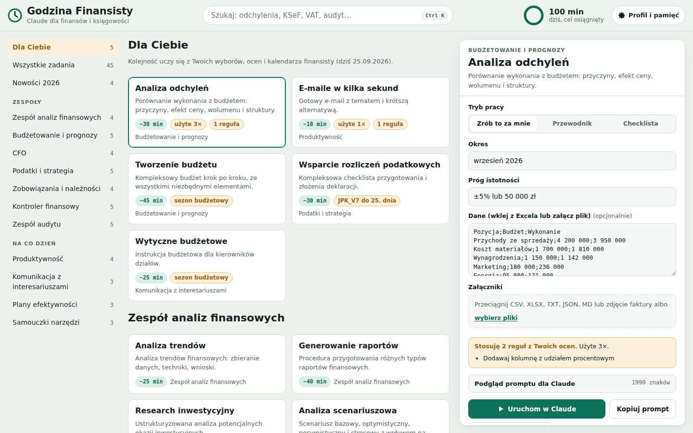
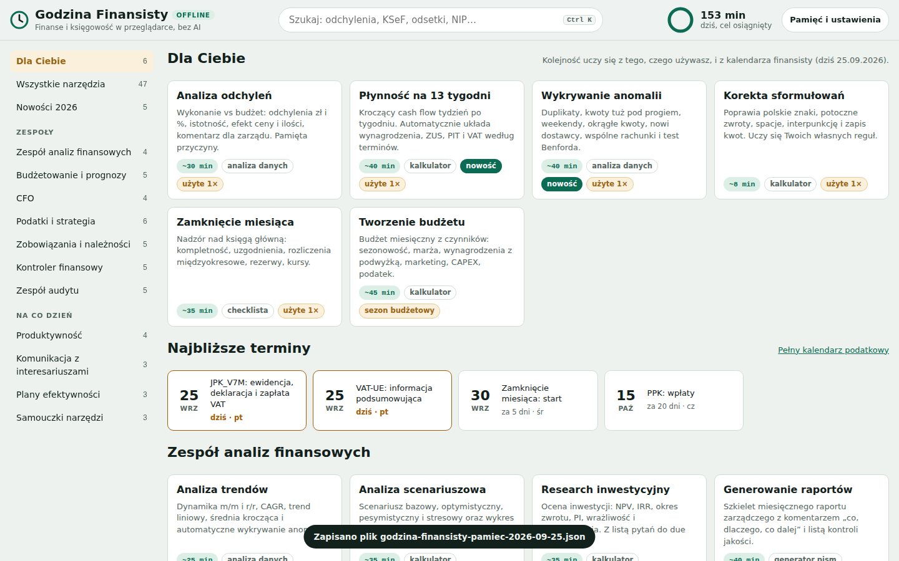

# Godzina Finansisty

**Wersja online:** https://claude.ai/artifact/BkZfemvxgBFqSx3aQqLrDo (prywatny artefakt, udostępnisz go przez menu Share)

Samouczące się narzędzie dla działów finansowych, które pracuje z Claude. Powstało na podstawie infografiki „Save 1hr per Day with Copilot in Finance” (Nicolas Boucher). Całość jest przetłumaczona na polski, dopasowana do polskich przepisów i rozszerzona o nowości 2026.



## Co zawiera

| Element | Plik | Do czego służy |
|---|---|---|
| Aplikacja (artefakt Claude) | `app/godzina-finansisty.html` | Wersja publikowana w claude.ai. Uruchamia zadania bezpośrednio w Claude. |
| **Wersja offline (bez Claude)** | `dist/godzina-finansisty-offline.html` | Jeden plik HTML. Działa w każdej przeglądarce bez internetu, bez AI i bez konta. Opis niżej. |
| Wersja samodzielna HTML | `dist/godzina-finansisty.html` (kopia: `dist/index.html`) | Otwierasz w przeglądarce. Kopiuje prompt do claude.ai albo łączy się z API Anthropic przez Twój klucz. |
| Skill dla Claude | `claude-skill/godzina-finansisty/` | `SKILL.md`, katalog 45 zadań i plik pamięci `pamiec.md`, który Claude sam aktualizuje. |
| Specyfikacja | `PROMPT.md` | Oryginalne polecenie przepisane na profesjonalny prompt. |
| Testy | `tests/e2e.cjs`, `tests/offline.cjs` | 20 + 22 testy end-to-end w Playwright. |

## 45 zadań w 11 obszarach

- **Zespoły z diagramu:** analizy finansowe, budżetowanie i prognozy, CFO, podatki, zobowiązania i należności, kontroler, audyt (po 4 zadania z infografiki).
- **Pierścień „na co dzień”:** produktywność (e-maile, korekta, streszczenia, wolne pytanie), komunikacja z interesariuszami, plany efektywności, samouczki Excel, PowerPoint i Outlook.
- **Nowości 2026:** KSeF bez stresu, raportowanie ESG (CSRD/ESRS), płynność na 13 tygodni, wykrywanie anomalii w transakcjach.

Każde zadanie ma rolę eksperta, pola do wypełnienia, trzy tryby pracy (**Zrób to za mnie**, **Przewodnik**, **Checklista**) i prompt w strukturze XML zalecanej dla Claude.

## Wersja offline: niezależna od Claude

Plik `dist/godzina-finansisty-offline.html` pobierasz i otwierasz dwuklikiem. Nie potrzebuje internetu, AI ani instalacji. Nie wysyła żadnych danych: wszystko liczy się w przeglądarce, a pamięć zostaje na Twoim komputerze.



Każde zadanie z diagramu działa tu jako narzędzie, które samo liczy albo tworzy dokument (47 narzędzi):

| Rodzaj | Narzędzia |
|---|---|
| **Analizy danych** (wklej z Excela lub wczytaj CSV/XLSX) | analiza odchyleń z efektem ceny i ilości, analiza trendów z wykrywaniem anomalii, prognoza (6 metod z testem trafności MAPE), uzgodnienia sald, wykrywanie anomalii i test Benforda, analiza ABC sprzedaży i dostawców, streszczenie dokumentu |
| **Kalkulatory** | płynność na 13 tygodni, budżet roczny z sezonowością, scenariusze i wykres tornado, NPV/IRR/okres zwrotu, wskaźniki KPI (DSO, DIO, DPO, CCC, dług netto/EBITDA), walidator faktury (NIP, REGON, IBAN, VAT, split payment, numer KSeF), dobór próby do testów kontroli, kalkulator finansisty (VAT, marża/narzut, waluty, dni robocze), strategia podatkowa (kwestionariusz ulg) |
| **Kalendarz podatkowy** | terminy ZUS, PIT, CIT, VAT/JPK i sprawozdań z polskimi świętami i przesunięciem na dzień roboczy; eksport do Outlooka (.ics) |
| **Generatory pism** | przypomnienia i wezwania do zapłaty z odsetkami i rekompensatą 40/70/100 EUR, nota odsetkowa, pisma do dostawców, e-maile, raport zarządczy, komunikacja finansowa, wytyczne budżetowe, agenda spotkania, karta ustalenia audytu, program audytu, notatka podatkowa, struktura prezentacji |
| **Checklisty** | rozliczenia miesiąca (VAT, JPK, ZUS, CIT), KSeF, kontrola podatkowa, zamknięcie miesiąca, zgodność, sprawozdanie roczne, ESG, due diligence M&A, plan strategiczny, obieg faktur, Outlook |
| **Rejestry** | rejestr ryzyk z mapą ciepła, macierz kontroli wewnętrznych (RCM), lista usprawnień procesów |
| **Biblioteka** | formuły Excela po polsku i angielsku (+ Twoje własne) |

**Jak się uczy (bez AI):**

- zapamiętuje typ pozycji (przychód lub koszt) i przyczyny odchyleń, a przy kolejnej analizie je podpowiada;
- punkty checklisty oznaczone dwa razy jako „nie dotyczy” ukrywa w następnych okresach;
- w wykrywaniu anomalii pamięta wyjątki oznaczone jako „Normalne”;
- stosuje Twoje reguły językowe w korekcie tekstu, Twoje szablony pism, cele KPI i własne formuły;
- podpowiada wcześniej wpisane wartości pól;
- układa sekcję „Dla Ciebie” według tego, czego używasz, i kalendarza finansisty (zamknięcie miesiąca, JPK do 25., ZUS do 20., sezon budżetowy);
- liczy zaoszczędzony czas dopiero wtedy, gdy faktycznie pracujesz w narzędziu.

Całą pamięć przejrzysz, usuniesz lub przeniesiesz (eksport i import JSON) w **Pamięć i ustawienia**.

## Jak się uczy (wersja z Claude)

1. **Profil firmy** (branża, ERP, standard rachunkowości, styl) trafia do każdego promptu.
2. **Oceny:** „Trafiona” albo „Do poprawy” z komentarzem. Claude zamienia komentarz na krótką regułę globalną albo regułę dla danego zadania.
3. **Poprawki:** edytujesz odpowiedź, klikasz „Naucz się z moich poprawek”, a Claude porównuje obie wersje i wyciąga reguły.
4. **Pamięć pól:** ostatnie wartości i podpowiedzi dla każdego pola.
5. **„Dla Ciebie”:** ranking z użycia, ocen i kalendarza finansisty (zamknięcie miesiąca, JPK_V7 do 25., ZUS i PIT do 20., sezon budżetowy, sprawozdania roczne).
6. **Zegar:** licznik zaoszczędzonych minut z celem 60 minut dziennie, plus statystyki tygodniowe.
7. **Eksport i import** pamięci w JSON, np. żeby przenieść ją do zespołu.

Pamięć zostaje w Twojej przeglądarce (localStorage). Nic nie trafia na zewnętrzne serwery poza zapytaniem do Claude.

## Uruchomienie

```bash
npm run build   # buduje dist/index.html i katalog skilla
npm test        # build + testy obu wersji (wymaga Playwright i Chromium)
```

Wersja samodzielna: otwórz `dist/index.html`. Bez klucza przycisk **Uruchom w Claude** kopiuje prompt i otwiera claude.ai. Z kluczem API (**Profil i pamięć → Dane i połączenie**) odpowiedź streamuje się na stronie. Do wyboru są modele Claude Sonnet 5, Opus 5.5 i Haiku 4.5.

Skill: skopiuj katalog `claude-skill/godzina-finansisty` do `~/.claude/skills/` (Claude Code) albo spakuj go do ZIP i wgraj w claude.ai w **Ustawienia → Możliwości → Skills**.

## Skróty

- `Ctrl K`: szukaj zadania
- `Ctrl Enter`: uruchom w Claude
- Wklejenie pliku (`Ctrl V`) albo przeciągnięcie CSV, XLSX lub zdjęcia faktury: dołączenie danych

> Odpowiedzi AI nie zastępują porady podatkowej ani prawnej. Terminy i przepisy (zwłaszcza KSeF i ESRS) zawsze sprawdzaj z aktualnym stanem prawnym.
